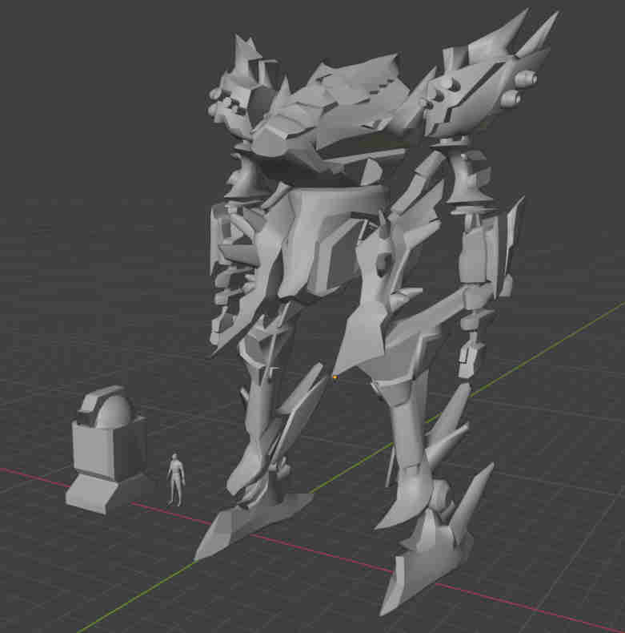

# Du
## Open source Armored Core inspired prototype ## 
### Made in Godot 4.3 ###

The name of this project comes from my son. Whenever he sees a videogame with robots he would just call it Du. This started as a simple third-person game for him but it ended up as a learning tool to explore and implement mechanics that I´ve enjoyed by playing Armored Core games. By the time this readme file was written I´ve played Armored Core 4, For Answer, Nexus, Ninebreaker and finally the original PS1 title. 

My vision with this project is that some day it reaches a playable state and other people can improve upon it, learning from it's code (or laughing at how bad it is).
It currently has shaders for visual style (which I plan to refine). There's no current artistic style already defined, but the 3D models I'm working on have a style more alike Armored Core 4th gen graphics, instead of let's say, a more low poly PS1 style or AAA ultra realistic UE5 type graphics.

This project is not intended to be a mission based game that emulates the nature of Fromsoftware's Armored Core games. Currently the idea is to be open to generate any style of gameplay with the current mech movement controls. 

Currently there are only player controls tested with an Xinput joystick. Future adaptation for keyboard and mouse is a priority. The controls play much like AC gen 4: dual analog sticks for movement and view, left trigger for boosting, right trigger for quickboosting, "A" button for jumping (unlike Armored Core). Dual wielding with L and R shoulder buttons is pending. No pause menu or map has been implemented.

*Current pov of the game*

*Quick Blender screenshot for mech scale*

## AI Content ##
There's currently one texture I´ve used as a placeholder for a couple of models generated by AI but will be soon replaced by something with more quality. All 3D models and code are done by hand, some snippets and corrections have been made with the help of AI LLM apps but there has been an important focus on actually learning what everything does and trying my own ideas. If this project was made out of AI vibe coding it would be much more complete by now (and unstable, probably).

#### For license information, please refer to the LICENSE file.
